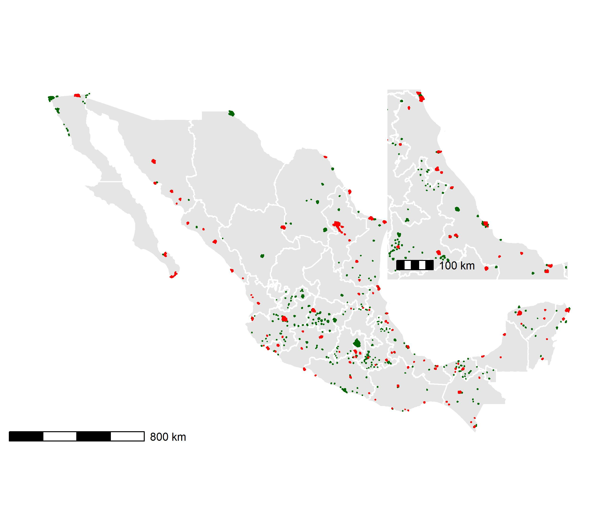

class: left, top

```{r xaringan-fit-screen, echo=FALSE}
xaringanExtra::use_fit_screen()
```

```{r xaringanExtra, echo = FALSE}
xaringanExtra::use_progress_bar(color = "#0051BA", location = "top")
```

```{r xaringan-tachyons, echo=FALSE}
xaringanExtra::use_tachyons()
```

```{r share-again, echo=FALSE}
xaringanExtra::use_share_again()
```

```{r xaringan-logo, echo=FALSE}
xaringanExtra::use_logo(
  image_url = "https://www.gob.mx/cms/uploads/action_program/main_image/26942/post_post_portadavectores.gif",
  width = "110px",
  height = "228px",
  position = xaringanExtra::css_position(top = "1em", right = "1em")
)
```

### Ciclo de Vida del Programa de Prevención y Control del Dengue

```{r, dpi=300,echo=FALSE, fig.align ="center", out.height="100%",out.width = "100%"}
DiagrammeR::grViz("digraph {

  # graph definitions
  graph [layout = dot, rankdir = TB]
  
  
  
  ###########
  # node definitions
  node [shape = circle, style = filled, color = black, fixedsize = true, width = 2] 
  prog_den [label = 'Programa de Dengue',  fillcolor =  '#4285F4', color = 'white', fontcolor = 'white']
  #
  brote [label = 'Brote',  fillcolor = 'darkorange', color = 'white', fontcolor = 'black']
  control_probables [label = 'Control de Probables',  fillcolor = 'darkorange', color = 'white', fontcolor = 'black']
  
  node [shape = circle, style = filled, color = grey] 
  irs [label = 'Rociado Residual',  fillcolor = 'darkorange', color = 'white', fontcolor = 'black']
  cl [label = 'Control Larvario',  fillcolor = 'darkorange', color = 'white', fontcolor = 'black']
  ovitraps [label = 'Ovitrampas',  fillcolor = 'darkorange', color = 'white', fontcolor = 'black']
  adult [label = 'Colecta de Adultos',  fillcolor = 'darkorange', color = 'white', fontcolor = 'black']
  enc_ver [label = 'Encuesta Verificación',  fillcolor = 'darkorange', color = 'white', fontcolor = 'black']
  plat [label = 'Plataforma',  fillcolor = 'darkorange', color = 'white', fontcolor = 'black']
  
  #########
  node [shape = rectangle, style = filled, color = black, fixedsize = true, width = 2.5] 
  hotspots [label = 'Hotspots',  fillcolor = 'darkorange', color = 'white', fontcolor = 'black']
  #act [label = 'Casos Actuales',  fillcolor = 'darkorange', color = 'white', fontcolor = 'black']
 
  # Vigilancia epidemiológica
  epi [label = 'Vigilancia Epidemiológica',  fillcolor = '#DB4437', color = 'white', fontcolor = 'white']
  
  #
  data_historic [label = 'Datos Históricos',  fillcolor =  'gray', color = 'white', fontcolor = 'white']
  data_datos_actuales [label = 'Datos Actuales',  fillcolor =  'gray', color = 'white', fontcolor = 'white']
  data_acumulados [label = 'Datos Acumulados',  fillcolor =  'gray', color = 'white', fontcolor = 'white']
  data_trans_activa [label = 'Transmisión Activa',  fillcolor =  'gray', color = 'white', fontcolor = 'white']
  
  
  ent [label = 'Vigilancia Entomológica',  fillcolor = '#0F9D58', color = 'white', fontcolor = 'white']
  
  
  
  ind [label = 'Indicadores',  fillcolor = '#0F9D58', color = 'white', fontcolor = 'black']
  ###################
  prog_den -> {epi, ent}[penwidth = 4]
  
  epi -> {data_historic  data_datos_actuales}[penwidth = 4]
  data_datos_actuales -> {data_acumulados, data_trans_activa}[penwidth = 4]
  
  data_historic -> {hotspots}[penwidth = 4]
  
  data_trans_activa -> {control_probables}[penwidth = 4] 
  data_acumulados -> {brote}[penwidth = 4] 
  
  control_probables -> {plat}[penwidth = 4]
  brote -> {plat}[penwidth = 4]
 

  
  hotspots -> {
  cl[arrowhead = crow, arrowtail = box, color = 'Maroon']
  irs[arrowhead = crow, arrowtail = box, color = 'Maroon']
  } -> plat[penwidth = 4]
  
  ent -> {adult, ovitraps, enc_ver} -> plat[penwidth = 4]  
  plat -> ind[penwidth = 4]
  ind -> prog_den[penwidth = 4]
  

 
 
 
  }", 
  height = 600)

```

---
### Línea de Tiempo de la Vigilancia Epidemiológica & Entomológica
<hr style="height:2px;border-width:0;color:#330019;background-color:#330019">

```{r,dpi=300, echo=FALSE, fig.align ="center", out.height="100%", out.width = "100%", warning=FALSE, message=FALSE}
library(timevis)
a <- timevis::timevis(data = data.frame(start = c("2008-01-01", 
                                                  "2011-01-01",
                                                  "2017-01-01",
                                                  "2017-01-01",
                                                  "2008-01-01",
                                                  "2021-01-01", 
                                                  "2021-03-01"),
                                        end = c(Sys.Date(), 
                                                Sys.Date(), 
                                                Sys.Date(),
                                                Sys.Date() , 
                                                Sys.Date(), 
                                                Sys.Date(), 
                                                Sys.Date()),
                          content = c("Vigilancia Epidemiológica Pasiva", 
                                      "Vigilancia Entomológica con Ovitrampas", 
                                      "Vigilancia Entomológica con Adultos",
                                      "Entomovirología",
                                      "Hotspots Históricos",
                                      "Actuales (clusters de casos y cadenas de transmisión)",
                                      "Transmisión Activa (Identificación de cadenas de transmisión: knox test)"),
                          #type = c("background"),
                          style = c("text-align: center; font-weight: bold; color: white; font-size: 12px; border-color: #DB4437; border: 2px solid white; background-color: #DB4437;",
                                    "text-align: center; font-weight: bold; color: white; font-size: 12px; border-color: #4285F4; border: 2px solid white; background-color: #4285F4;",
                                    "text-align: center; font-weight: bold; color: white; font-size: 12px; border-color: #4285F4; border: 2px solid white; background-color: #4285F4;", 
                                    "text-align: center; font-weight: bold; color: white; font-size: 12px; border-color: #0F9D58; border: 2px solid white; background-color: #0F9D58;",
                                    "text-align: center; font-weight: bold; color: white; font-size: 12px; border-color: darkorange; border: 2px solid white; background-color: darkorange;", 
                                    "text-align: left; font-weight: bold; color: white; font-size: 12px; border-color: darkorange; border: 2px solid white; background-color: darkorange;", 
                                    "text-align: righ; font-weight: bold; color: white; font-size: 12px; border-color: darkorange; border: 2px solid white; background-color: darkorange;"),
                          group = c(1, 2, 2,3, 4, 4,4)),
        groups = data.frame(id = 1:4, 
                            content = c("Paciente", 
                                        "Vector",
                                        "Virus-Vector",
                                        "Análisis espacial"),
                            style = c("text-align: center; font-weight: bold; color: white; font-size: 15px; border-color: #DB4437; border: 2px solid white; background-color: #DB4437;",
                                      "text-align: center; font-weight: bold; color: white; font-size: 15px; border-color: #4285F4; border: 2px solid white; background-color: #4285F4;",
                                      "text-align: center; font-weight: bold; color: white; font-size: 15px; border-color: #0F9D58; border: 2px solid white; background-color: #0F9D58;",
                                      "vertical-align: middle; text-align: center; font-weight: bold; color: white; font-size: 20px; border-color: darkorange; border: 2px solid white; background-color: darkorange;")))

a


style <- "
.vis-time-axis { 
background-color: lightgray;
backgroud-border: 3px solid #73AD21;
backgroun-opacity; 0.1;
font-weight: bold;
text-align: center;
vertical-align: middle;
border: 1.5px solid #73AD21;
font-size: 15px;}
.vis-odd {
color: blue;
vertical-align: middle;
  }

"
htmltools::html_print(htmltools::tagList(htmltools::tags$style(style), a))

```


---
### **Análisis Espacial del Vector del Dengue**
<hr style="height:2px;border-width:0;color:#330019;background-color:#330019">

```{r, echo=FALSE, out.width='100%', fig.align='center'}
DiagrammeR::grViz("digraph {
                  # graph definitions
  graph [layout = dot, rankdir = TB]
  
  # node definitions
  node [shape = rectangle, 
  style = filled, 
  color = grey, 
  nodesep = .5,
  fixedsize = true, 
  width = 2.5] 
  
  # edge definition
  edge [color = grey, arrowhead = normal, arrowtail = dot]
  
  ##### entomological data
  
  ento [label = 'Vigilancia Entomológica',  fillcolor =  '#FF5A5F', color = 'white', fontcolor = 'white']
  data_historic [label = 'Datos Históricos',  fillcolor =  'gray', color = 'white', fontcolor = 'white']
  
  years  [label = '2014-2019',  fillcolor =  'gray', color = 'white', fontcolor = 'white']
  data_datos_actuales [label = 'Datos del Año Actual',  fillcolor =  'gray', color = 'white', fontcolor = 'white']
  data_acumulados [label = 'Datos hasta la Semana Actual',  fillcolor =  'gray', color = 'white', fontcolor = 'white']
  data_trans_activa [label = 'Semana Actual',  fillcolor =  'gray', color = 'white', fontcolor = 'white']
  
  
  ##### Spatial Data
  
  geo_data [label = 'Geoestatistical Data',  fillcolor =  '#0F9D58', color = 'white', fontcolor = 'white']
 
  
 
 # Análisis 
 spde [label = 'SPDE-INLA',  fillcolor =  'orange', color = 'white', fontcolor = 'black']
 hotspots [label = 'Hotspots Analysis',  fillcolor =  'orange', color = 'white', fontcolor = 'black']
 #prediction [label = 'Predicción Espacial de Huevos',  fillcolor =  'orange', color = 'white', fontcolor = 'black']
 
 # entomological study
 ovitraps [label = 'Ovitrampas',  fillcolor =  'orange', color = 'white', fontcolor = 'black']
  enc_ver [label = 'Encuesta-Verificación',  fillcolor =  'orange', color = 'white', fontcolor = 'black']
  adults [label = 'Colecta de Adultos',  fillcolor =  'orange', color = 'white', fontcolor = 'black']
 
 
 # software
 r_rstudio [label = 'R & RStudio',  fillcolor =  'DodgerBlue', color = 'white', fontcolor = 'white']
 deneggs [label = 'deneggs Package',  fillcolor =  'DodgerBlue', color = 'white', fontcolor = 'white'] 
 
 
 
 
 ##### define the relation
 
 
 ento -> {ovitraps  enc_ver adults} 
 
 {ovitraps adults} -> geo_data -> {data_historic data_datos_actuales}
 data_historic -> years
 
 data_datos_actuales -> {data_acumulados data_trans_activa}
 
 {years data_acumulados data_trans_activa} ->spde -> hotspots
 
 {hotspots} -> r_rstudio -> deneggs
 
}")

```

---
### **Análisis Espacial del Vector del Dengue**
<hr style="height:2px;border-width:0;color:#330019;background-color:#330019">

```{r, echo=FALSE,dpi=300,  fig.align ="center",out.height="70%", out.width = "90%"}
DiagrammeR::grViz("digraph {

  # graph definitions
  graph [layout = dot, rankdir = TB]
  
  # node definitions
  node [shape = rectangle, style = filled, color = grey] 
  
  #
  cenaprece [label = 'CENAPRECE',  fillcolor = 'SeaGreen', color = 'white', fontcolor = 'white']
  ovitrap [label = 'Ovitrampas',  fillcolor = 'SeaGreen', color = 'white', fontcolor = 'white']
  coord [label = 'Coordenadas',  fillcolor = 'SeaGreen', color = 'white', fontcolor = 'white']
  ovicoord [label = 'ovi + coord']
  
  # flow chart for inegi
  inegi [label = 'INEGI', fillcolor = 'DeepSkyBlue', color = 'white', fontcolor = 'black']
  loc [label = 'Localidades Shapefile', fillcolor = 'DeepSkyBlue', color = 'white', fontcolor = 'black']

  ###
  mesh [label = '1. Mesh']
  spde [label = '2. SPDE']
  
  proj_train [label = '3a. Projector Matrix A. Test']
  proj_test [label = '3b. Projector Matrix A. Train']
  
  spatial_field [label = '4. Spatial Field W']
  
  stack_train [label = '5a. Stack Train']
  stack_test [label = '5b. Stack Test']
  stack_pred [label = '5c. Stack Prediction']
  stack_joint [label = '6. Joint Stack']
  
  formula [label = '7. Formula']
  inla [label = '8. INLA',  fillcolor = 'Orange', color = 'white', fontcolor = 'white']
  
 
  
  # edge definitions with the node IDs
  edge [color = black]
  cenaprece -> {ovitrap, coord} -> ovicoord
  #
  inegi -> loc -> ovicoord
  #
  ovicoord -> mesh
  mesh -> spde -> spatial_field ->  stack_joint
  spde -> {proj_train,  proj_test}
  spatial_field -> {stack_test, stack_train, stack_pred} ->  stack_joint -> formula -> inla 
  proj_train -> stack_train
  proj_test -> stack_test

  
  }", 
  height = 500)

```


.tiny[.blue[.footnote[ [Modificado de Zuur et al 2017](http://www.highstat.com/index.php/beginner-s-guide-to-regression-models-with-spatial-and-temporal-correlation); [Dzul-Manzanilla et al 2019](http://acaentmex.org/entomologia/revista/2019/EMF/EMF%20497-501.pdf)]]]
---

### **Análisis Espacial del Vector del Dengue**
<hr style="height:2px;border-width:0;color:#330019;background-color:#330019">

```{r, echo=FALSE,dpi=300, fig.align ="center", out.height="70%", out.width = "90%"}
DiagrammeR::grViz("digraph {

  # graph definitions
  graph [layout = dot, rankdir = TB]
  
  # node definitions
  node [shape = rectangle, style = filled, color = grey] 
  
  #
  
  inla [label = '8. INLA',  fillcolor = 'Orange', color = 'white', fontcolor = 'white']
  stat [label = '9. Statistics']
  
  zeros [label = '9.1. % Zeros']
  disp [label = '9.2. Dispersion Statistics']
  dic [label = '9.3. Deviance Information Criterio']
  pear [label = '9.4. Pearson Residuals']
  
  ##
  p [label = 'Poisson']
  zip [label = 'ZeroInflated Poisson']
  nb [label = 'Negative Binomial']
  zinb [label = 'ZeroInflated Poisson Negative Binomial']
  
  sel [label = '10.Select the Distribution & Model']
  
  # prediction ####
  ext_pred [label = '11. Extract Index Prediction']
  coor_pred [label = '12. Extract Coordinates Prediction']
  pred [label = '13. Prediction']
 
  hotspots [label = '14.Hotspots', fillcolor = 'Orange', color = 'white', fontcolor = 'white']
  save [label = '15. Save results']
  
  mappred [label = '15a. Prediction Map']
  hotspotsb [label = '15b. Hotspots']
  dics [label = '15c. DICs']
  loc [label = '15d. Locality']
  data [label = '15e. Dataset']
  
  # edge definitions with the node IDs
  edge [color = black]
  inla -> stat
  stat -> {zeros, disp, dic,pear} -> {p, zip, nb, zinb} -> sel
  sel -> ext_pred -> coor_pred -> pred -> hotspots -> save
  save -> {mappred, hotspotsb, dics, loc, data}

  
  }", 
  height = 500)

```


.tiny[.blue[.footnote[ [Modificado de Zuur et al 2017](http://www.highstat.com/index.php/beginner-s-guide-to-regression-models-with-spatial-and-temporal-correlation); [Dzul-Manzanilla et al 2019](http://acaentmex.org/entomologia/revista/2019/EMF/EMF%20497-501.pdf)]]]

---
### **Vigilancia Entomológica con Ovitrampas**
<hr style="height:2px;border-width:0;color:#330019;background-color:#330019">




.tiny[.blue[.footnote[localidades urbanas = 4553, localidades urbanas con ovitrampas = 530, y localidades urbanas de alto risgo con ovitrampas 122]]]


---
### Vigilancia Entomológica con Ovitrampas
<hr style="height:2px;border-width:0;color:#330019;background-color:#330019">

.pull-left[
.small[.justify-left[
&nbsp;
- **Muestro Sistemático**
 - 1 manzana por cada 4 a 6 en zonas planas
 - 1 manzana por cada 2 a 4 en zonas con pendientes
 &nbsp;

- **Muestreo por autoselección**
 - una casa por cada lado de la manzana
 &nbsp;

- **Colecta semanal**
&nbsp;

- **Captura en línea**
]
]
]

.pull-right[
.blue[Coatzacoalcos]
```{r,fig.align ="center",fig.width=5, fig.height=8,echo=FALSE, warning=FALSE, message=FALSE}
library(sf)
library(magrittr)
source('C:/Users/HOME/OneDrive/cursos_impartidos/2021/foro_estadistica/3.Functions/block_surveillance.R')
path_coord <- "C:/Users/HOME/Dropbox/cenaprece_datasets/2022/30_veracruz/DescargaOvitrampasMesFco.txt"

blocks_surveillance(locality = "Coatzacoalcos",
                    cve_geo = "30",
                    path_coords = path_coord,
                    blocks = rgeomex::blocks_ine20_mx_e)


```
]

---
### Toma de Decisiones & Ovitrampas
<hr style="height:2px;border-width:0;color:#330019;background-color:#330019">

```{r, echo=FALSE, warning=FALSE, message=FALSE, out.height="80%", out.width = "100%"}
# Steo 1. load the function ####
source("C:/Users/HOME/Dropbox/r_developments/r_dashboards/github_pages/test_denv_dash_yuc/functions/ovitraps_occupancy_abundancy.R")


ovitraps_occupancy_abundancy(ovitraps_path = "C:/Users/HOME/Dropbox/cenaprece_datasets/2022/31_yucatan",
                             scale = "ovitraps")

```


---
### Decisiones Basadas en Evidencia & Ovitrampas

```{r, echo=FALSE, warning=FALSE, message=FALSE, out.height="80%", out.width = "100%"}
# Steo 1. load the function ####
source("C:/Users/HOME/Dropbox/r_developments/r_dashboards/github_pages/test_denv_dash_yuc/functions/ovitraps_occupancy_abundancy.R")


ovitraps_occupancy_abundancy(ovitraps_path = "C:/Users/HOME/Dropbox/cenaprece_datasets/2022/31_yucatan",
                             scale = "blocks")

```
---
### Decisiones Basadas en Evidencia & Ovitrampas
```{r xaringan-panelset, echo=FALSE}
xaringanExtra::use_panelset()
```

.panelset.sideways[
```{r include=FALSE}
ovitraps_distribution <- c(source = "Distribución de Ovitrampas Código",
                           output = "Distribución de Ovitrampas Mapa")
ovitraps_percentil_risk <- c(source = "Riesgo Entomológico Código",
                             output = "Riesgo Entomologico Mapa")
ovitraps_hotblocks <- c(source = "Manzanas Calientes Código",
                        output = "Manzanas Calientes Mapa")
```

```{r panelset = ovitraps_distribution, warning=FALSE, message=FALSE}
# Step 1. load the function 
source("C:/Users/HOME/Dropbox/r_developments/r_new_functions/3.Functions/ovitraps_risk_percentile.R")
# Steo 2. define the path 
path_vect <- "31_yucatan"
path_coord <- paste(path_vect, "DescargaOvitrampasMesFco.txt", sep = "/")
# Step 3. apply the function 
ovitraps_risk_percentile(path_vector = path_vect,
                         path_coord = path_coord,
                         cve_edo = "31",
                         map_view = FALSE,
                         weeks = 43,
                         locality = "Valladolid",
                         size = 4,
                         alpha = .3,
                         leg_title = "Huevos",
                         palette_vir = "viridis",
                         risk = FALSE)

```

```{r panelset = ovitraps_percentil_risk, warning=FALSE, message=FALSE}
# Step 1. load the function 
source("C:/Users/HOME/Dropbox/r_developments/r_new_functions/3.Functions/ovitraps_risk_percentile.R")

# Step 2. apply the function 
ovitraps_risk_percentile(path_vector = "31_yucatan",
                         path_coord = path_coord,
                         cve_edo = "31_yucatan/DescargaOvitrampasMesFco.txt",
                         map_view = TRUE,
                         weeks = 43,
                         locality = "Valladolid",
                         size = 4,
                         alpha = .3,
                         leg_title = "Huevos",
                         palette_vir = "viridis",
                         risk = FALSE)
```


```{r panelset = ovitraps_hotblocks, warning=FALSE, message=FALSE}
# Step 1. load the function 
source("C:/Users/HOME/Dropbox/r_developments/r_new_functions/3.Functions/eggs_hotblocks.R")

# Step 2. apply the function
eggs_hotspots(path_vect = "31_yucatan",
              cve_ent = "31",
              locality = "Tizimín",
              week = 43,
              brand = "slack")
```

]


---
## Dios Botic!
<hr style="height:2px;border-width:0;color:#330019;background-color:#330019">
&nbsp;

- ***Bio*** : https://fdzul.github.io/web_site_fadm/

- ***email***       :     [felipe.dzul.m@gmail.com]()

- ***celular***     :     [8139945623]()

- ***slides***:     https://animated-longma-729cee.netlify.app/talks/hotspots_eggs/#1


.footnote[La presentación fue creada via [**xaringan**](https://github.com/yihui/xaringan),
[**revealjs**](https://revealjs.com/),
[remark.js](https://remarkjs.com), [**knitr**](http://yihui.name/knitr),
& [R Markdown](https://rmarkdown.rstudio.com) en [R]() & [RStudio](2.R_Scripts/libs/rstudio_leaflet/rstudio_leaflet.css).]
