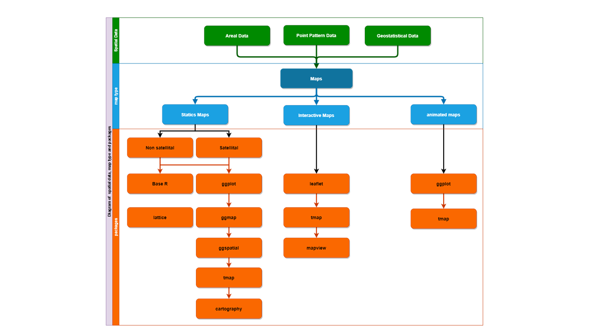
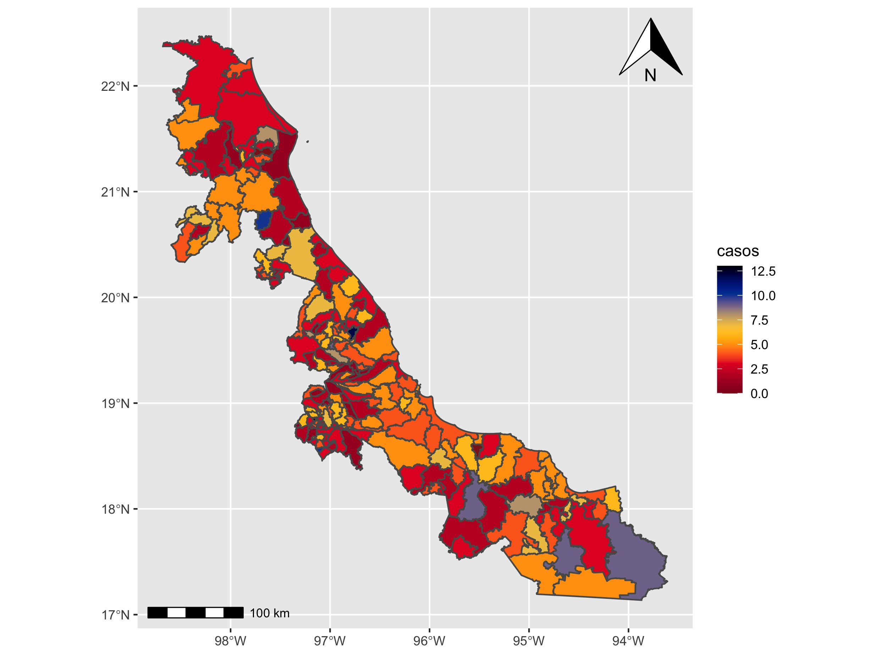

class: left, top

```{r xaringan-fit-screen, echo=FALSE}
xaringanExtra::use_fit_screen()
```

```{r xaringanExtra, echo = FALSE}
xaringanExtra::use_progress_bar(color = "#0051BA", location = "top")
```

```{r xaringan-tachyons, echo=FALSE}
xaringanExtra::use_tachyons()
```

```{r share-again, echo=FALSE}
xaringanExtra::use_share_again()
```

```{r xaringan-logo, echo=FALSE}
xaringanExtra::use_logo(
  image_url = "https://www.ssaver.gob.mx/wp-content/uploads/2021/04/cropped-logoencabezado6abr2.jpg",
  width = "310px",
  height = "428px",
  position = xaringanExtra::css_position(top = "1em", right = "1em")
)
```

# **Temas**
<hr style="height:2px;border-width:0;color:#330019;background-color:#330019">

- Datos espaciales.
&nbsp;

- Tipos de Mapas.
&nbsp;

- Información básica para un mapa.
&nbsp;

- Mapas estáticos en R.
  -  Mapas en base.
  -  Mapas en ggplot2.
  -  Mapas en tmap.
  -  Mapas en mapsf..
&nbsp;

- Mapas interactivos en R
  - leaflet
  - plolty
  - tmap
  - mapview


---
# Tipos de mapas
<hr style="height:2px;border-width:0;color:#330019;background-color:#330019">


```{r, eval=TRUE, echo =FALSE, fig.width=6, fig.height=6}

```


---
# Point Pattern Data 

<hr style="height:2px;border-width:0;color:#330019;background-color:#330019">

```{r point_pattern_data2, echo = FALSE, warning=FALSE, message=FALSE }
# Step 1. load the dataset ####
load("C:/Users/felip/OneDrive/proyects/geocoding_mex/2021/den_mex_2021/9.RData_geocoded/den2021_positivos.RData")

# Step 2. extract the locality boundary ####
gua <- rgeomex::extract_ageb(locality =  c("Guadalajara", "Tlaquepaque", 
                                           "Zapopan", "Tonalá"),
                             cve_geo = "14") 

# Step 3. extract the dengue cases by locality ####

# Step 3.1 transform the dengue cases geocoded in sf object ####
z <- z |>
    sf::st_as_sf(coords = c("long", "lat"),
                 crs = 4326)

# Step 3.2 extract the dengue cases in the locality of guadalajara ####

z_cases <- z[gua$locality, ] 

# Step 4. check the dengue cases by locality

# Step 4.1 create the palette ###
z_cases$week_factor <- factor(z_cases$SEM)

pal_fac <- leaflet::colorFactor(palette = fishualize::fish(n = length(unique(z_cases$week_factor)),
                                                       option = "Scarus_hoefleri",
                                                       direction = -1),
                            domain = z_cases$week_factor)

pal_num <- leaflet::colorNumeric(palette = fishualize::fish(n = length(unique(z_cases$SEM)),
                                                       option = "Scarus_hoefleri",
                                                       direction = -1),
                            domain = z_cases$SEM)


l <- leaflet::leaflet(data = z_cases) |>
    leaflet::addTiles()|>
    leaflet::addCircleMarkers(radius = 7,
                              fillColor = ~pal_fac(week_factor),
                              fillOpacity = 1,
                              stroke = 3,
                              weight = 2,
                              color = "white",
                              opacity = .8) |>
    leaflet::addLegend(pal = pal_fac,
                       values = z_cases$week_factor,
                       opacity = 1,
                       title = "Semana",
                       position = "topright")
esri <- grep("^Esri|OpenTopoMap|OpenStreetMap|HERE|CartoDB|NASAGIBS", leaflet::providers, value = TRUE)


for (provider in esri) {
    l <- l |> leaflet::addProviderTiles(provider,
                                         group = provider)
}

l |>
    leaflet::addLayersControl(baseGroups = names(esri),
                              options = leaflet::layersControlOptions(collapsed = TRUE)) |>
    leaflet::addMiniMap(tiles = esri[[1]],
                        toggleDisplay = TRUE,
                        position = "bottomleft") |>
    htmlwidgets::onRender(" function(el, x) {
            var myMap = this;
      myMap.on('baselayerchange',
        function (e) {
          myMap.minimap.changeLayer(L.tileLayer.provider(e.name));
        })
    }")

```


---
# Geostatistical Data

```{r geostatistical_data, echo = FALSE, warning=FALSE, message=FALSE}
# Step 2. load the dataset ####
load("C:/Users/felip/OneDrive/cursos_impartidos/2022/maps_R/8.RData/guadalajara_12.RData")

# Step 1. extract the data ####
x <- guadalajara_12$data |>
    sf::st_as_sf(coords = c("Pocision_X", "Pocision_Y"),
                 crs = 4326)

# Step 2. extract the locality ###
loc <- guadalajara_12$loc


# Step 3. load of block ####
blocks <- rgeomex::blocks_ine20_mx_b[loc,]

# Step 4. extract the blocks ####
blocks_ovitraps <- blocks[x,]

# Step 5. define the palette ####
pal_num <- leaflet::colorNumeric(palette = fishualize::fish(n = length(unique(x$eggs)),
                                                            option = "Scarus_hoefleri",
                                                            direction = -1),
                                 domain = x$eggs)

l <- leaflet::leaflet() |>
    leaflet::addTiles() |>
    leaflet::addPolygons(data = blocks_ovitraps,
                         group = "blocks",
                         weight = 2,
                         opacity = .8) |>
    leaflet::addCircleMarkers(data = x |> dplyr::filter(eggs == 0),
                              group = "ovitraps_negative",
                              radius = 5,
                              fillColor = "red",
                              fillOpacity = 1,
                              stroke = 3,
                              weight = 2,
                              color = "white",
                              opacity = .8) |>
    leaflet::addCircleMarkers(data = x |> dplyr::filter(eggs > 0),
                              group = "ovitraps",
                              radius = 5,
                              fillColor = ~pal_num(eggs),
                              fillOpacity = 1,
                              stroke = 3,
                              weight = 2,
                              color = "white",
                              opacity = .8) |>
    leaflet::addLegend(pal = pal_num,
                       values = x$eggs,
                       opacity = 1,
                       title = "Números de Huevos",
                       position = "topright") 
esri <- grep("^Esri|OpenTopoMap|OpenStreetMap|HERE|CartoDB|NASAGIBS", leaflet::providers, value = TRUE)


for (provider in esri) {
    l <- l |> leaflet::addProviderTiles(provider,
                                        group = provider)
}

l |>
    leaflet::addLayersControl(baseGroups = names(esri),
                              options = leaflet::layersControlOptions(collapsed = TRUE),
                              overlayGroups = c("blocks", "ovitraps_negative", "ovitraps")) |>
    leaflet::addMiniMap(tiles = esri[[1]],
                        toggleDisplay = TRUE,
                        position = "bottomleft") |>
    htmlwidgets::onRender(" function(el, x) {
            var myMap = this;
      myMap.on('baselayerchange',
        function (e) {
          myMap.minimap.changeLayer(L.tileLayer.provider(e.name));
        })
    }")


```

---
# Areal Data



---
# Requisito de un mapa
<hr style="height:2px;border-width:0;color:#330019;background-color:#330019">

.can-edit.key-likes[
- La información geográfica (json, sh, etc).
- La base de datos.
- La variable de interes.
]


---
# Mapas estáticos en R
<hr style="height:2px;border-width:0;color:#330019;background-color:#330019">


.panelset[

.panel[.panel-name[base R]
```{r map_base_r, fig.show='hide', warning=FALSE, message=FALSE}
# step 1. load municipality & add the dengue cases ####
library(sf)
x <- rgeomex::AGEM_inegi19_mx |>
    dplyr::filter(CVE_ENT %in% c("30")) |>
    dplyr::mutate(casos = rpois(n = dplyr::n(), lambda = 4))
# Step 2. plot the map with R base ####
plot(x["casos"], 
     key.pos = 4,
     axes = TRUE, 
     graticule = TRUE,
     key.width = .2,
     key.length = .8)
```
]

.panel[.panel-name[Mapa base R]
```{r map_with_base_r, echo=FALSE, warning=FALSE, message=FALSE}
# step 1. load municipality & add the dengue cases ####
library(sf)
x <- rgeomex::AGEM_inegi19_mx |>
    dplyr::filter(CVE_ENT %in% c("30")) |>
    dplyr::mutate(casos = rpois(n = dplyr::n(), lambda = 4))
# Step 2. plot the map with R base ####
plot(x["casos"], 
     key.pos = 4,
     axes = TRUE, 
     graticule = TRUE,
     key.width = .2,
     key.length = .8)
```
]


.panel[.panel-name[ggplot2]
```{r map_ggplot2, fig.show='hide', warning=FALSE, message=FALSE}
# step 1. load municipality & add the dengue cases ####
library(sf)
x <- rgeomex::AGEM_inegi19_mx |>
    dplyr::filter(CVE_ENT %in% c("30")) |>
    dplyr::mutate(casos = rpois(n = dplyr::n(), lambda = 4)) 

# Step 2. plot the map with ggplot2 ####
ggplot2::ggplot() +
    ggplot2::geom_sf(data = x,
                     ggplot2::aes(fill = casos)) +
    fishualize::scale_fill_fish() +
    ggspatial::annotation_scale(location = "bl") +
    ggspatial::annotation_north_arrow(location = "tr")
```
]

.panel[.panel-name[Mapa ggplot2]

]
.panel[.panel-name[tmap]
```{r maptmap, fig.show='hide', warning=FALSE, message=FALSE}
# step 1. load municipality & add the dengue cases ####
library(sf)
x <- rgeomex::AGEM_inegi19_mx |>
    dplyr::filter(CVE_ENT %in% c("30")) |>
    dplyr::mutate(casos = rpois(n = dplyr::n(), lambda = 4))
# Step 2. plot the map with tmap ####
library(tmap)
tmap::tm_shape(x) +
    tmap::tm_polygons(col = "casos") +
    tmap::tm_compass(position = c(.2, .9)) +
    tmap::tm_scale_bar(position = c(.1, .02))
```
]
.panel[.panel-name[Mapa tmap]

]
]


---

# Thanks!

&nbsp;

- ***Bio*** : https://fdzul.github.io/web_site_fadm/

- ***email***       :     felipe.dzul.m@gmail.com

- ***celular***     :     228 229 3419

- ***slides***:     https://animated-longma-729cee.netlify.app/talks/spatial_data/#1


.footnote[La presentación fue creada via [**xaringan**](https://github.com/yihui/xaringan),
[**revealjs**](https://revealjs.com/),
[remark.js](https://remarkjs.com), [**knitr**](http://yihui.name/knitr),
& [R Markdown](https://rmarkdown.rstudio.com) en [R]() & [RStudio](2.R_Scripts/libs/rstudio_leaflet/rstudio_leaflet.css).]
